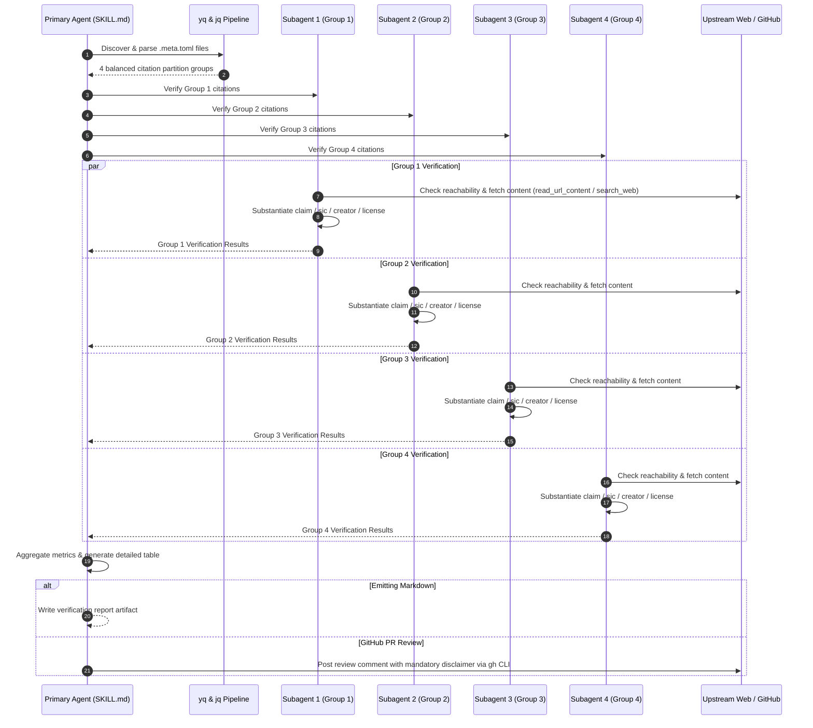

# Meta TOML Citation Verifier (`meta-toml-citation-verifier`)

An agentic skill for discovering, parsing, partitioning, and substantiating `.meta.toml` citation sidecars against authoritative web sources using parallel subagents.

---

## 1. Citation Formats & Schema Documentation

The `.meta.toml` specification defines structured sidecars that record source attribution, licensing, claims, and adaptation provenance. The formats below reflect the standards implemented across `sdlcbot/personas/ext/` and repository asset management.

### A. External Adapted Persona Citations
Used when an external open-source persona, prompt, or agent configuration is adapted for internal use.

#### Example 1: GitHub Awesome Copilot Adaptation ([accessibility.meta.toml](file:///home/ben/Projects/sdlcbot/personas/ext/accessibility.meta.toml))
```toml
[meta]
adaptation = "Condensed and normalized for sdlcbot's persona format."
creator = "GitHub, Inc. and community contributors"
copyright_notice = "Copyright GitHub, Inc."
license = "MIT"
license_file = "LICENSES/mit-github-awesome-copilot.txt"
license_url = "https://github.com/github/awesome-copilot/blob/main/LICENSE"
original_file_name = "accessibility.agent.md"
retrieved_at = "2026-08-20"
source_location = "https://github.com/github/awesome-copilot/blob/main/agents/accessibility.agent.md"
source_repository = "https://github.com/github/awesome-copilot"
```

#### Example 2: Third-Party Community Plugin ([security-auditor.meta.toml](file:///home/ben/Projects/sdlcbot/personas/ext/security-auditor.meta.toml))
```toml
[meta]
adaptation = "Condensed and normalized for sdlcbot's persona format."
creator = "Seth Hobson and contributors"
copyright_notice = "Copyright (c) 2024 Seth Hobson"
license = "MIT"
license_file = "LICENSES/mit-wshobson-agents.txt"
license_url = "https://github.com/wshobson/agents/blob/main/LICENSE"
original_file_name = "plugins/comprehensive-review/agents/security-auditor.md"
retrieved_at = "2026-08-20"
source_location = "https://github.com/wshobson/agents/blob/main/plugins/comprehensive-review/agents/security-auditor.md"
source_repository = "https://github.com/wshobson/agents"
```

#### Example 3: Extended Architecture Adaptation ([task-breakdown.meta.toml](file:///home/ben/Projects/sdlcbot/personas/ext/task-breakdown.meta.toml))
```toml
[meta]
adaptation = "Condensed and normalized for sdlcbot's persona format; extended with conflict-aware concurrency planning."
creator = "GitHub, Inc. and community contributors"
copyright_notice = "Copyright GitHub, Inc."
license = "MIT"
license_file = "LICENSES/mit-github-awesome-copilot.txt"
license_url = "https://github.com/github/awesome-copilot/blob/main/LICENSE"
original_file_name = "task-planner.agent.md"
retrieved_at = "2026-08-20"
source_location = "https://github.com/github/awesome-copilot/blob/main/agents/task-planner.agent.md"
source_repository = "https://github.com/github/awesome-copilot"
```

---

### B. Internal Original Persona Citations
Used when a persona or template is authored internally and has no external upstream dependencies.

#### Example 1: Principal Live Coding Persona ([interview-coder.meta.toml](file:///home/ben/Projects/sdlcbot/personas/ext/interview-coder.meta.toml))
```toml
[meta]
creator = "sdlcbot"
license = "Apache-2.0"
retrieval_date = "2026-08-21T07:55:00-07:00"
source = "internal"
status = "original"
version = "1.0.0"
```

#### Example 2: Concurrency & Quality Reviewer ([interview-reviewer.meta.toml](file:///home/ben/Projects/sdlcbot/personas/ext/interview-reviewer.meta.toml))
```toml
[meta]
creator = "sdlcbot"
license = "Apache-2.0"
retrieval_date = "2026-08-21T08:25:00-07:00"
source = "internal"
status = "original"
version = "1.0.0"
```

---

### C. Fact, Claim, Summary, and Verbatim (`sic`) Citations
Used when asserting a specific technical fact, factual summary, benchmark result, or verbatim quotation (`sic`) that must be backed by an authoritative online source.

#### Example 1: Verbatim Quote (`sic`) and Standards Fact
```toml
[meta]
creator = "IETF Network Working Group"
fact = "HTTP/2 binary framing enables bidirectional request and response multiplexing over a single TCP connection."
license = "IETF Trust"
license_url = "https://trustee.ietf.org/documents/trust-legal-provisions/"
retrieved_at = "2026-08-21"
sic = "The HTTP/2 framing layer provides basic units of protocol message interchange."
source_location = "https://datatracker.ietf.org/doc/html/rfc7540#section-4.1"
source_repository = "https://github.com/ietf-wg-httpbis"
```

#### Example 2: Empirical Benchmark Claim
```toml
[meta]
claim = "Go sync.Pool reduces garbage collection pause times by up to 40% under high-allocation concurrency."
creator = "The Go Authors"
license = "BSD-3-Clause"
license_url = "https://go.dev/LICENSE"
retrieved_at = "2026-08-21"
source_location = "https://go.dev/blog/execution-tracer-2024"
source_repository = "https://github.com/golang/go"
statement = "sync.Pool provides an efficient amortized object cache across concurrent goroutines."
```

---

### D. Sidecar Media and Binary Asset Citations
Used for binary assets (PNG, SVG, JPG, WASM, PDF) where license and source cannot be placed within source code comments. Stored adjacent as `<original_file_name>.meta.toml`.

#### Example: Vector Diagram Sidecar (`architecture-diagram.svg.meta.toml`)
```toml
[meta]
creator = "Cloud Native Computing Foundation (CNCF)"
copyright_notice = "Copyright The Linux Foundation"
description = "Official CNCF Landscape architectural glyph."
license = "CC-BY-4.0"
license_url = "https://creativecommons.org/licenses/by/4.0/"
original_file_name = "cncf-landscape-glyph.svg"
retrieved_at = "2026-08-10"
source_location = "https://raw.githubusercontent.com/cncf/artwork/main/other/cncf-landscape/cncf-landscape-glyph.svg"
source_repository = "https://github.com/cncf/artwork"
```

---

## 2. Verification Architecture & Workflow



---

## 3. CLI Quick Reference

### Parse and Partition with Helper Script
```bash
# Partition all citations in a directory into 4 groups (JSON)
./scripts/partition_citations.sh --dir /path/to/sdlcbot/personas/ext --groups 4 --output json

# Partition and display human-readable summary
./scripts/partition_citations.sh --dir /path/to/sdlcbot/personas/ext --output summary

# Partition citations modified in GitHub Pull Request #42
./scripts/partition_citations.sh --pr 42
```

### Direct `yq` and `jq` One-Liner
```bash
find . -name "*.meta.toml" -type f | sort | while IFS= read -r f; do
  yq -p=toml -o=json '.meta + {"file": filename}' "$f"
done | jq -s '
  def partition4:
    . as $all |
    [range(4)] | map(. as $idx | {
      group_id: ($idx + 1),
      citations: [ $all[range($idx; ($all | length); 4)] ]
    } | .count = (.citations | length));
  partition4
'
```
