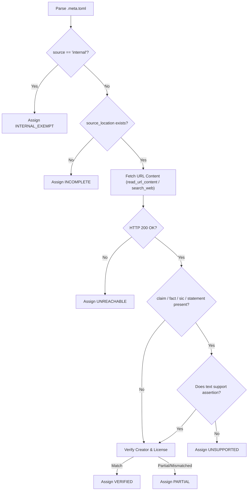

# Citation Verification Rubric & Decision Tree

This document outlines the evaluation criteria, verification protocol, and classification rubric applied by the subagents during citation substantiation.

---

## 1. Verification Dimensions

For every `.meta.toml` record, subagents evaluate three core dimensions:

1. **Reachability & Existence**:
   - Does `source_location` (or `source_repository`, `license_url`) resolve via HTTP GET request (status 200)?
   - Is the target document reachable, not behind a strict paywall/login barrier, and not returning 404/410/500 errors?

2. **Substantiation & Alignment**:
   - If `claim`, `fact`, `summary`, `statement`, or `sic` is present:
     - Does the upstream text contain semantic, factual, or verbatim confirmation of the statement?
     - If `sic` is supplied, does the text match verbatim (allowing minor whitespace variations)?
   - If `original_file_name` or `adaptation` is present:
     - Does the target repository/file contain the base persona or code structure described?
   - If `source == "internal"`:
     - Validate internal consistency and author fields; mark as internal exemption.

3. **Attribution & Legal Integrity**:
   - Does the upstream license match the declared `license` and `license_url`?
   - Does the creator/copyright attribution match upstream repository records or commit history?

---

## 2. Status Taxonomy

| Status Code | Description | Criteria |
| :--- | :--- | :--- |
| `VERIFIED` | Fully substantiated | Source URL is reachable, upstream content actively corroborates all claims/facts/statements/quotes, and license/creator attributes align. |
| `PARTIAL` | Partially verified | Source URL is reachable and general topic matches, but specific claims are ambiguous, slightly modified, or creator/license info differs slightly. |
| `UNSUPPORTED` | Content mismatch / Disproven | Source URL exists, but the source explicitly contradicts or lacks evidence for the asserted claim/fact/statement. |
| `UNREACHABLE` | Broken link / Network failure | Target URL returns 404 Not Found, 410 Gone, DNS failure, or connection timeout. |
| `INCOMPLETE` | Missing essential metadata | Record lacks critical fields (e.g., missing both `source_location` and `source` for an external asset). |
| `INTERNAL_EXEMPT` | Internal source | Record is marked `source = "internal"` and `status = "original"`; external web verification is bypassed. |

---

## 3. Decision Logic

